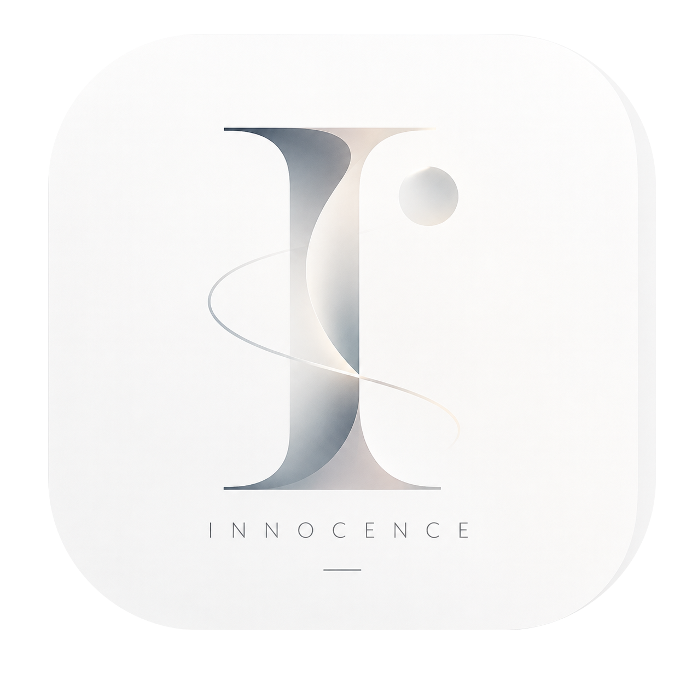

<p align="center">
  
</p>

<h1 align="center">Innocence</h1>

<p align="center">面向学习、自律、陪伴和团队互助的双端应用</p>

<p align="center">
  <a href="README.md">简体中文</a> · <a href="README_EN.md">English</a>
</p>

<p align="center">
  <a href="LICENSE"></a>
  
  =3.4">
  
  
  
</p>

Innocence 当前以 Flutter + Spring Boot 为主线，覆盖 Windows 桌面端与移动端。

## 当前状态

- Windows 端采用 Large / Medium / Small 自适应画布与 Focus Orb。
- Windows 应用、窗口和系统托盘已使用正式 Innocence Logo。
- 支持纯白、侘寂、Mid-Century Modern 和 Glass 四套可切换主题。
- 已具备认证、资料、设置、备忘录、统计、通知、好友和团队等主要交互骨架。
- 后端业务数据按当前登录用户隔离。

## 仓库结构

```text
client/flutter_app/       Flutter 客户端
server/innocence-server/  Spring Boot 服务端
docs/                     产品、契约与排查文档
infra/docker/             MySQL / Redis 本地开发基础设施
progress/                 项目进度与检查点
```

## 技术栈

- 客户端：Flutter、Dart、Material 3、shared_preferences
- 服务端：Java 21、Spring Boot 3.3.2、MyBatis、MySQL 8、Redis
- 平台：Windows、Android

## 本地开发

### 启动依赖

在 `infra/docker` 下启动 `docker-compose.dev.yml`，默认使用 MySQL `3306` 和 Redis `6379`。

### 启动服务端

```bash
cd server/innocence-server
mvn spring-boot:run
```

需要 JDK 21 和 Maven 3.9+。邮件密码通过 `INNOCENCE_MAIL_PASSWORD` 环境变量注入。

### 启动客户端

```bash
cd client/flutter_app
flutter pub get
flutter run -d windows
```

Windows 发布版本：

```bash
flutter build windows --release
```

产物位于 `build/windows/x64/runner/Release/`。

## 文档

- [文档索引](docs/README.md)
- [项目计划](docs/planning/Innocence-项目计划书.md)
- [Windows 自适应桌面体验](docs/planning/Innocence-Windows自适应桌面体验.md)
- [前端修改未生效排查](docs/troubleshooting/Innocence-前端修改未生效排查.md)

## 项目地址

[github.com/2877905731/Innocence](https://github.com/2877905731/Innocence)
